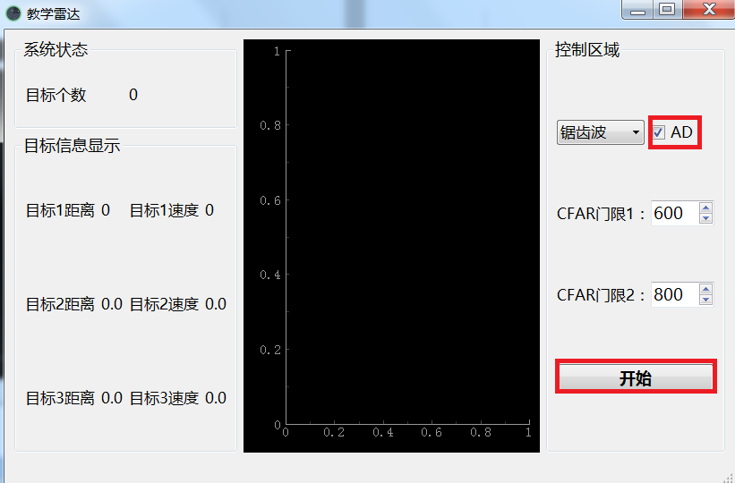

# 教学雷达使用说明书

## 雷达电源

打开雷达电源按钮，绿色指示灯点亮，雷达开机工作，其中绿色指示灯代表雷达剩余电量，若绿色指示灯亮的个数少于2个，说明电量不足，请充电后使用。

## 网口连接

用网线连接电脑与雷达，雷达工作之前确保网线已经插好，否则雷达不能正常工作。

## 上位机软件

在电脑桌面上打开上位机软件，软件如图3-1所示。

## 网卡选择

打开上位机软件后，出现界面如图4-1所示，根据电脑选择相应的网卡。

## 雷达开始工作

选择网卡后，接着会出现如下界面，如图5-1所示，点击开始按钮即可工作。

点击开始按钮后，若出现目标，会在上位机上显示目标的个数与相对应的距离速度信息，分别如图5-2与5-3所示。

## 门限调节

在使用时一般使用默认门限即可，若雷达探测目标效果不好，可以适当调节门限，如图6-1所示。其中FCAR门限1代表速度维门限，CFAR门限2代表距离维门限。

## AD数据采集

勾选AD复选框，如图7-1所示，如然后点击开始即可采集AD数据，采集完成后会提示采集成功。

生成的AD数据在桌面上位机文件夹中存放，如图7-2所示。

## 注意事项

1. AD数据采集存放的AD数据会发生覆盖，一次实验过后需要及时保存。
2. 如在采集AD数据过程中如果提示接收不到网口包的情况，请重复点击开始按钮，直到提示采集数据成功。

